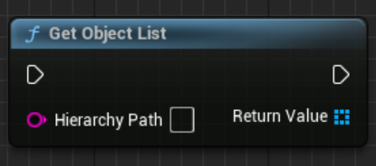
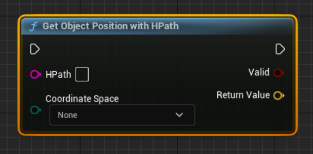
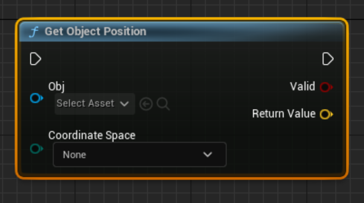
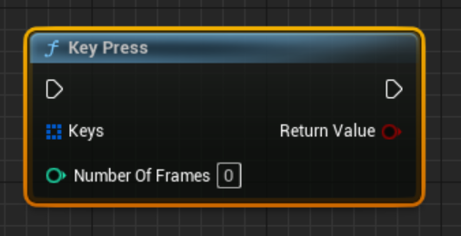
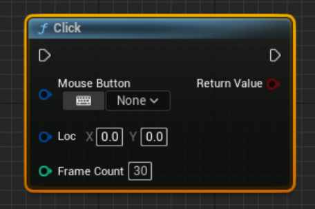
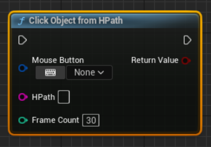
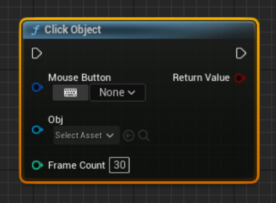
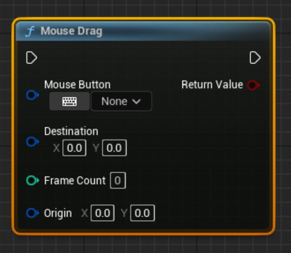
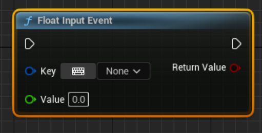

# UBP_GDIOAPI


Inherits from UObject

## Public Functions

|                | Name           |
| -------------- | -------------- |
| TArray< UObject * > | **[GetObjectList](class_u_b_p___g_d_i_o_a_p_i.md#function-getobjectlist)**(FString hierarchyPath)<br>This method returns a TArray of all Unreal UObject matching the passed in HPath.  |
| UObject * | **[GetGameObject](class_u_b_p___g_d_i_o_a_p_i.md#function-getgameobject)**(FString hierarchyPath)<br>Get the Object Reference matching the provided HierarchyPath argument, or NULL.  |
| FVector | **[GetObjectPositionWithHPath](class_u_b_p___g_d_i_o_a_p_i.md#function-getobjectpositionwithhpath)**(FString HPath, CoordinateConversionTypes coordinateSpace, bool & valid)<br>Return the position of a specific object.The position returned is in worldspace coordinates for an actor or a component and screenspace coordinates for widgets.  |
| FVector | **[GetObjectPosition](class_u_b_p___g_d_i_o_a_p_i.md#function-getobjectposition)**(UObject * obj, CoordinateConversionTypes coordinateSpace, bool & valid)<br>Return the position of a specific object.The position returned is in worldspace coordinates for an actor or a component and screenspace coordinates for widgets.  |
| bool | **[GetIntFieldValue](class_u_b_p___g_d_i_o_a_p_i.md#function-getintfieldvalue)**(FString hierarchyPath, FString field, int & value) |
| bool | **[GetStringFieldValue](class_u_b_p___g_d_i_o_a_p_i.md#function-getstringfieldvalue)**(FString hierarchyPath, FString field, FString & value) |
| bool | **[GetBoolFieldValue](class_u_b_p___g_d_i_o_a_p_i.md#function-getboolfieldvalue)**(FString hierarchyPath, FString field, bool & value) |
| bool | **[GetDoubleFieldValue](class_u_b_p___g_d_i_o_a_p_i.md#function-getdoublefieldvalue)**(FString hierarchyPath, FString field, double & value) |
| bool | **[SetIntFieldValue](class_u_b_p___g_d_i_o_a_p_i.md#function-setintfieldvalue)**(FString hierarchyPath, FString field, int value) |
| bool | **[SetStringFieldValue](class_u_b_p___g_d_i_o_a_p_i.md#function-setstringfieldvalue)**(FString hierarchyPath, FString field, FString value) |
| bool | **[SetFloatFieldValue](class_u_b_p___g_d_i_o_a_p_i.md#function-setfloatfieldvalue)**(FString hierarchyPath, FString field, double value) |
| bool | **[SetBoolFieldValue](class_u_b_p___g_d_i_o_a_p_i.md#function-setboolfieldvalue)**(FString hierarchyPath, FString field, bool value) |
| bool | **[KeyPress](class_u_b_p___g_d_i_o_a_p_i.md#function-keypress)**(TArray< FKey > keys, int numberOfFrames)<br>Use this function to send arbitrary button states to the game.  |
| bool | **[Click](class_u_b_p___g_d_i_o_a_p_i.md#function-click)**(FKey mouseButton, FVector2D loc, int frameCount =30)<br>Use this function to perform in-game mouse-clicks.  |
| bool | **[ClickObjectFromHPath](class_u_b_p___g_d_i_o_a_p_i.md#function-clickobjectfromhpath)**(FKey mouseButton, FString HPath, int frameCount =30)<br>Use this function to interact with an in-game object using mouse-clicks.  |
| bool | **[ClickObject](class_u_b_p___g_d_i_o_a_p_i.md#function-clickobject)**(FKey mouseButton, UObject * obj, int frameCount =30)<br>Use this function to interact with an in-game object using mouse-clicks.  |
| FString | **[getHierarchyPath](class_u_b_p___g_d_i_o_a_p_i.md#function-gethierarchypath)**(UObject * obj, GDIO_HPATH_TYPES type)<br>Use this function to get the HierarchyPath of any vaid UObject.  |
| bool | **[MouseMovetoPoint](class_u_b_p___g_d_i_o_a_p_i.md#function-mousemovetopoint)**(FVector2D destination, int frameCount, FVector2D origin)<br>Move the mouse to the destination vector.  |
| bool | **[MouseMovetoObject](class_u_b_p___g_d_i_o_a_p_i.md#function-mousemovetoobject)**(UObject * obj, int frameCount =30)<br>Move the mouse to the center of a specific object.  |
| bool | **[MouseMovetoObjectFromHPath](class_u_b_p___g_d_i_o_a_p_i.md#function-mousemovetoobjectfromhpath)**(FString HPath, int frameCount =30)<br>Move the mouse to the center of a specific object, identified by the HPath.  |
| bool | **[MouseDrag](class_u_b_p___g_d_i_o_a_p_i.md#function-mousedrag)**(FKey MouseButton, FVector2D destination, int frameCount, FVector2D origin)<br>Perform a mouse drag operation.  |
| bool | **[FloatInputEvent](class_u_b_p___g_d_i_o_a_p_i.md#function-floatinputevent)**(FKey key, double value)<br>Use this function to simulate a KeyAxis float input (axis). Pass 0 to stop sending the event.  |

## Public Functions Documentation

### function GetObjectList

```cpp
static inline TArray< UObject * > GetObjectList(
    FString hierarchyPath
)
```

This method returns a TArray of all Unreal UObject matching the passed in HPath. 

**Parameters**: 

  * **hierarchyPath** The Hpath to use for the query


**Return**: a TArray of UObject* matching the query.


<blueprint>
</blueprint> 


### function GetGameObject

```cpp
static inline UObject * GetGameObject(
    FString hierarchyPath
)
```

Get the Object Reference matching the provided HierarchyPath argument, or NULL. 

**Parameters**: 

  * **hierarchyPath** The timeout in seconds to wait for a response that the request was processed by the GameDriver agent.
  * **timeout** The timeout in seconds to wait for a response that the request was processed by the GameDriver agent.


**Return**: The matching UObject, if it exists.


<blueprint>
</blueprint> 


### function GetObjectPositionWithHPath

```cpp
static inline FVector GetObjectPositionWithHPath(
    FString HPath,
    CoordinateConversionTypes coordinateSpace,
    bool & valid
)
```

Return the position of a specific object.The position returned is in worldspace coordinates for an actor or a component and screenspace coordinates for widgets. 

**Parameters**: 

  * **HPath** The HierarchyPath of the object to return the position of.
  * **coordinateSpace** The coorindate space conversion to perform on the position before returning it. See gdio.common.objects.CoordinateConversion for more information.
  * **valid** out param set to true if the HPath resolves and the call is possible.


**Return**: The Vector3 position of the specific object.


<blueprint>
</blueprint> 


### function GetObjectPosition

```cpp
static inline FVector GetObjectPosition(
    UObject * obj,
    CoordinateConversionTypes coordinateSpace,
    bool & valid
)
```

Return the position of a specific object.The position returned is in worldspace coordinates for an actor or a component and screenspace coordinates for widgets. 

**Parameters**: 

  * **HPath** The HierarchyPath of the object to return the position of.
  * **coordinateSpace** The coorindate space conversion to perform on the position before returning it. See gdio.common.objects.CoordinateConversion for more information.
  * **valid** out param set to true if the HPath resolves and the call is possible.


**Return**: The Vector3 position of the specific object.


<blueprint>
</blueprint> 


### function GetIntFieldValue

```cpp
static inline bool GetIntFieldValue(
    FString hierarchyPath,
    FString field,
    int & value
)
```


### function GetStringFieldValue

```cpp
static inline bool GetStringFieldValue(
    FString hierarchyPath,
    FString field,
    FString & value
)
```


### function GetBoolFieldValue

```cpp
static inline bool GetBoolFieldValue(
    FString hierarchyPath,
    FString field,
    bool & value
)
```


### function GetDoubleFieldValue

```cpp
static inline bool GetDoubleFieldValue(
    FString hierarchyPath,
    FString field,
    double & value
)
```


### function SetIntFieldValue

```cpp
static inline bool SetIntFieldValue(
    FString hierarchyPath,
    FString field,
    int value
)
```


### function SetStringFieldValue

```cpp
static inline bool SetStringFieldValue(
    FString hierarchyPath,
    FString field,
    FString value
)
```


### function SetFloatFieldValue

```cpp
static inline bool SetFloatFieldValue(
    FString hierarchyPath,
    FString field,
    double value
)
```


### function SetBoolFieldValue

```cpp
static inline bool SetBoolFieldValue(
    FString hierarchyPath,
    FString field,
    bool value
)
```


### function KeyPress

```cpp
static inline bool KeyPress(
    TArray< FKey > keys,
    int numberOfFrames
)
```

Use this function to send arbitrary button states to the game. 

**Parameters**: 

  * **key** FKey indicating which key
  * **numberOfFrames** The number of frames to press and hold the keys for.


**Return**: TRUE if the GameDriver agent successfully processed the request.


<blueprint>
</blueprint> 


### function Click

```cpp
static inline bool Click(
    FKey mouseButton,
    FVector2D loc,
    int frameCount =30
)
```

Use this function to perform in-game mouse-clicks. 

**Parameters**: 

  * **MouseButton** The mouse button to use for the click operation.
  * **location** The Vector2 position to perform the mouse click.
  * **frameCount** The number of frames to click the specific position.


**Return**: TRUE if the click was able to be simulated


<blueprint>
</blueprint> 


### function ClickObjectFromHPath

```cpp
static inline bool ClickObjectFromHPath(
    FKey mouseButton,
    FString HPath,
    int frameCount =30
)
```

Use this function to interact with an in-game object using mouse-clicks. 

**Parameters**: 

  * **mouseButton** The fKey for the mouse button to use for the click operation.
  * **HPath** The HierarchyPath for the GameObject to perform a click on.
  * **frameCount** The number of frames to click the specific object.


**Return**: TRUE if the HPath resolved and the click was able to be simulated


<blueprint>
</blueprint> 


### function ClickObject

```cpp
static inline bool ClickObject(
    FKey mouseButton,
    UObject * obj,
    int frameCount =30
)
```

Use this function to interact with an in-game object using mouse-clicks. 

**Parameters**: 

  * **mouseButton** The fKey for the mouse button to use for the click operation.
  * **object** A ref to the object to perform a click on 
  * **frameCount** The number of frames to click the specific object.


**Return**: TRUE if the click was able to be simulated


<blueprint>
</blueprint> 


### function getHierarchyPath

```cpp
static inline FString getHierarchyPath(
    UObject * obj,
    GDIO_HPATH_TYPES type
)
```

Use this function to get the HierarchyPath of any vaid UObject. 

**Parameters**: 

  * **obj** The Object you want the HPath of
  * **type** "Absolute" or "Relative"


**Return**: The HierarchyPath of the Object as an FString


<blueprint>
</blueprint> 


### function MouseMovetoPoint

```cpp
static inline bool MouseMovetoPoint(
    FVector2D destination,
    int frameCount,
    FVector2D origin
)
```

Move the mouse to the destination vector. 

**Parameters**: 

  * **destination** Destination vector to move the mouse to.
  * **frameCount** The number of frames to complete the operaiton over.
  * **origin** The origin to start the mouse move operation. If null, the mouse move operation will begin at the current position of Input.mousePosition.


**Return**: TRUE if the method call was successfully processed by the GameDriver agent.


<blueprint>
</blueprint> 


### function MouseMovetoObject

```cpp
static inline bool MouseMovetoObject(
    UObject * obj,
    int frameCount =30
)
```

Move the mouse to the center of a specific object. 

**Parameters**: 

  * **obj** The obj to move the mouse pointer to.
  * **frameCount** The number of frames to complete the mouse move over.


**Return**: TRUE if the method call was successfully processed by the GameDriver agent.


<blueprint>
</blueprint> 


### function MouseMovetoObjectFromHPath

```cpp
static inline bool MouseMovetoObjectFromHPath(
    FString HPath,
    int frameCount =30
)
```

Move the mouse to the center of a specific object, identified by the HPath. 

**Parameters**: 

  * **HPath** The HierarchyPath to move the mouse pointer to.
  * **frameCount** The number of frames to compelte the mouse move over.


**Return**: TRUE if the HPath is valid


<blueprint>
</blueprint> 


### function MouseDrag

```cpp
static inline bool MouseDrag(
    FKey MouseButton,
    FVector2D destination,
    int frameCount,
    FVector2D origin
)
```

Perform a mouse drag operation. 

**Parameters**: 

  * **button** The mouse button as an FKey
  * **destination** The destination vector to drag the mouse to.
  * **frameCount** The number of frames taken to complete the drag operation.
  * **origin** The origin to start the drag operation. If null, the mouse drag operation will begin at the current position of Input.mousePosition.
  * **waitForEmptyInput** Wait for the empty input event to be returned from the agent before returning from the method call.


**Return**: TRUE if the requests was successfully processed by the GameDriver agent.


<blueprint>
</blueprint> 


### function FloatInputEvent

```cpp
static inline bool FloatInputEvent(
    FKey key,
    double value
)
```

Use this function to simulate a KeyAxis float input (axis). Pass 0 to stop sending the event. 

**Parameters**: 

  * **key** The FKey that you want to iput a value for
  * **key** The Value you want to inject


<blueprint>
</blueprint> 


-------------------------------

Updated on 2023-12-12 at 14:22:15 -0700